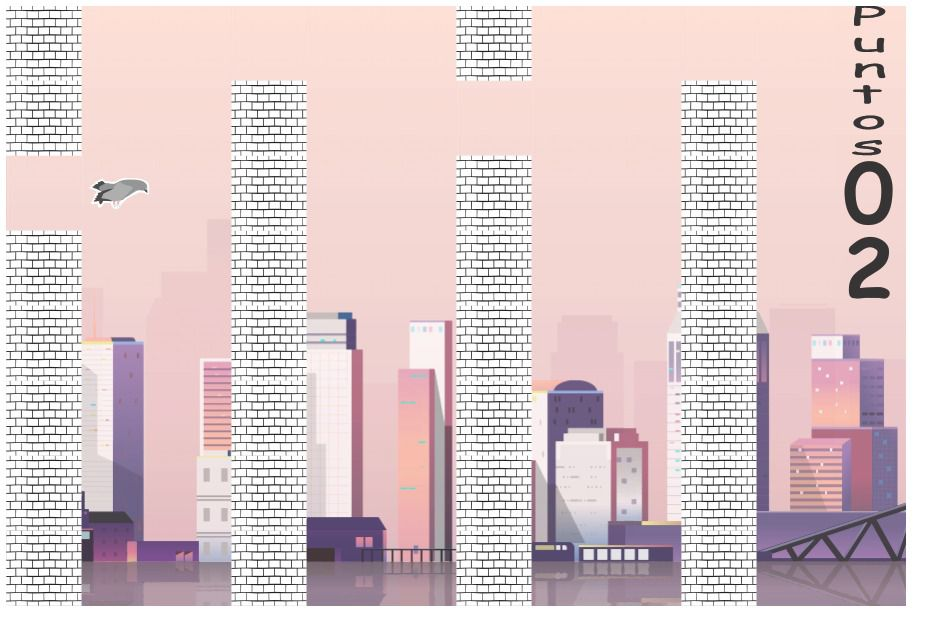
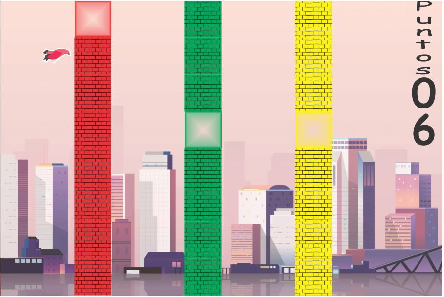
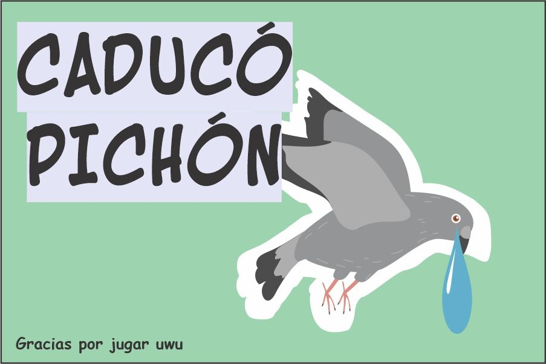
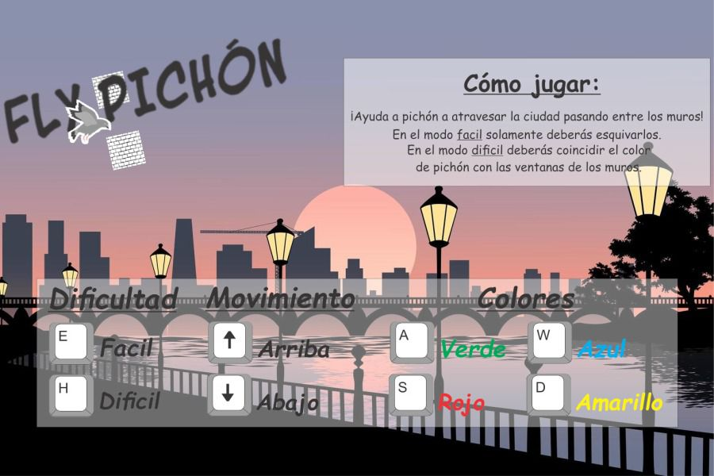

# Fly Pichón!

## Equipo de desarrollo

- Markevich, Jeremias
- Castillo, Marcos
- Oviedo, Agustin
- Maldonado, Araceli

## Capturas

## Reglas de Juego / Instrucciones

### Instrucciones:

Debemos ayudar a Pichón a cruzar los muros y seguir avanzando por la ciudad, debemos evitar chocar con los muros para no perder (en ambos modos) y en el modo dificil debemos cambiar el color de Pichón para que atraviese el respectivo muro sin problemas como también evitar chocar contra ellos para no perder.

### Controles: 

#### · Tanto en modo fácil como en dificil

- Flecha arriba para mover a Pichón hacia arriba.
-Flecha abajo para mover a Pichón hacia abajo.

#### · En dificil:

- Colores para pasar por el respectivo muro:

~ Amarillo: D
~ Azul: W
~ Verde: A
~ Rojo: S

## Otros

- Comision 1B / UNAHUR
- Versión de wollok: 1.0.0
- Una vez terminado, no tenemos problemas en que el repositorio sea público
